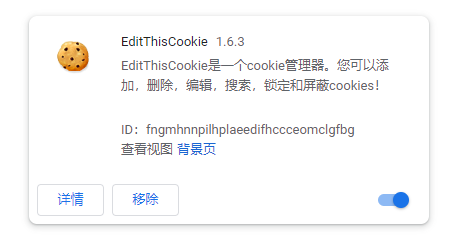
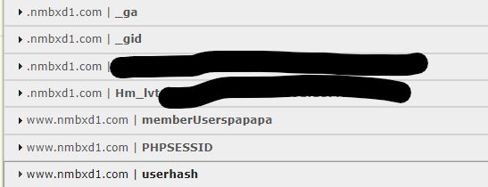
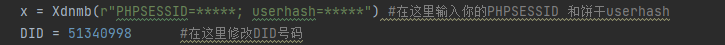

# Xdnmb_downer
X岛匿名版的下载工具

### 请勿用于违法用途，工具仅供学习交流使用，所下载及生成的文件版权属于X岛匿名版与原作者所有，请在24小时内删除

### 警告：务必确保自己有足够的饼干槽来访问小说版。否则本程序不保证能够运作

本意用于打包缓存小说版的文章，顺便提供更好的阅读体验

生成后的TXT位于txtoutput文件夹内

----------------------------------------------

使用方式：

首先打开chrome浏览器，在浏览器栏内输入

`chrome://extensions/`

进入插件安装页面，然后把右上角的***开发者模式***打开

把文件夹内部自带的EditThisCookie.crx插件拖动到浏览器窗口内进行安装。这个插件的作用是读取网站的cookies，cookies在后面运行main.py进行下载时是必要的

安装好了的Edit this cookie 插件如下图

访问X岛，登录-用户系统-饼干列表-随便选一个饼干-应用

找到你需要下载的小说串，点击右上角的EditThisCookie的图标开启插件，你应该能够看到下面的下拉框

点击`PHPSESSID`和`userhash`，把这两项内容原封不动地存储下来，随便存到哪里

使用一个文本编辑器（记事本也行）打开`main.py`，在下图所示的位置粘贴`PHPSESSID`、`userhash`替换星号，并把完整的8位串号以数字格式替换`DID=`后面原有的占位串号

最后

`python main.py`

或者直接双击`main.py`

---------------------------------------------------------------

题外话：

> 版权的代码我直接摆在你脸上了，反正公开的东西想搞事的谁也拦不住
> 
>  不搞编译了，没用的东西.jpg

